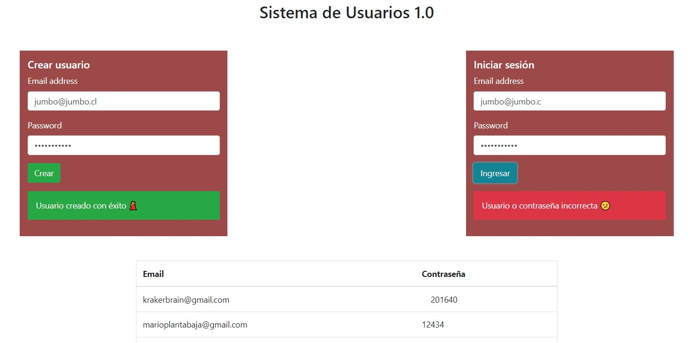

# Desafío Sistema de Usuarios 1.0

Se requiere desarrollar un sistema básico de usuarios que permita guardar usuarios e iniciar sesión,
persistiendo la data en PostgreSQL con el paquete pg y usando un servidor en Node para el desarrollo backend.

El servidor deberá disponibilizar las siguientes rutas:

- **/ GET**: Devuelve la aplicación cliente disponible en el apoyo del desafío
- **/usuario POST**: Recibe los datos de un nuevo usuario y los almacena en PostgreSQL.
- **/usuarios GET**: Devuelve todos los usuarios registrados con sus balances.
- **/login POST**: Recibe los datos para emitir una consulta SQL, valide el correo y contraseña recibido en la consulta.

## Comenzando 🚀

_Estas instrucciones te permitirán obtener una copia del proyecto en funcionamiento en tu máquina local para propósitos de desarrollo y pruebas._

- $ git clone https://github.com/krakerbrain/sistema_de_usuarios
- $ cd ../path/to/the/file
- $ npm install
- $ node index.js

### Requerimientos

1. Disponibilizar una ruta POST /usuario que utilice una función asíncrona para emitir
   una consulta SQL y almacenar un nuevo usuario en la tabla usuarios.
2. Disponibilizar una ruta POST /login que utilice una función asíncrona para emitir una
   consulta SQL, valide el correo y contraseña recibido en la consulta.
3. Disponibilizar una ruta GET /usuarios que utilice una función asíncrona para emitir
   una consulta SQL y devolver todos los usuarios de la tabla usuarios.

##### La aplicación debe verse así:

#### Notas de construcción:

- El HTML esta diseñado para mostrar en una tabla los usuarios que se van registrando
  con todos sus datos, y luego valida al usuario cuando se ingresan los datos en el cuadro
  de inicio de sesion. Es extraño pero así es el ejercicio
- Se implementa módulo Singleton para usar solo una instancia de pool

## Construido con 🛠️

- [nodeJS](https://nodejs.org/en/)

#### Usando las librerías:

- [node-postgres](https://node-postgres.com/api/pool)
- [http](https://nodejs.org/api/http.html)
- [fileSystem](https://nodejs.org/api/fs.html)

## Autor ✒️

- **Mario Montenegro**
